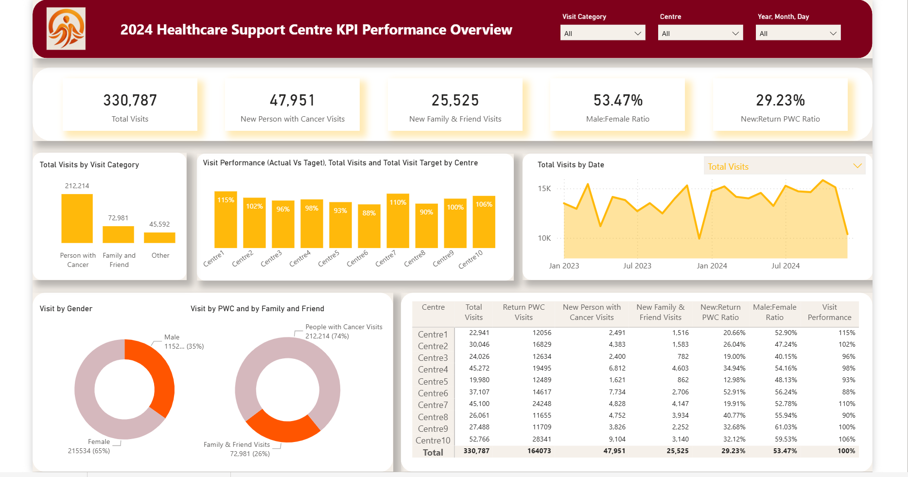
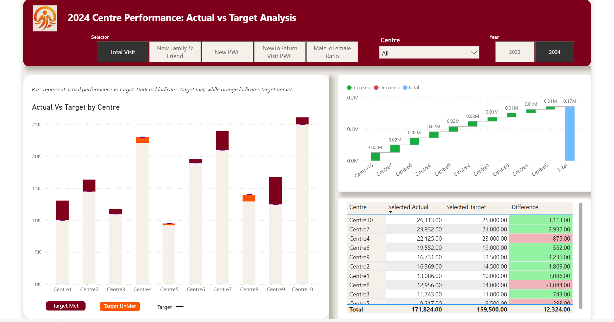
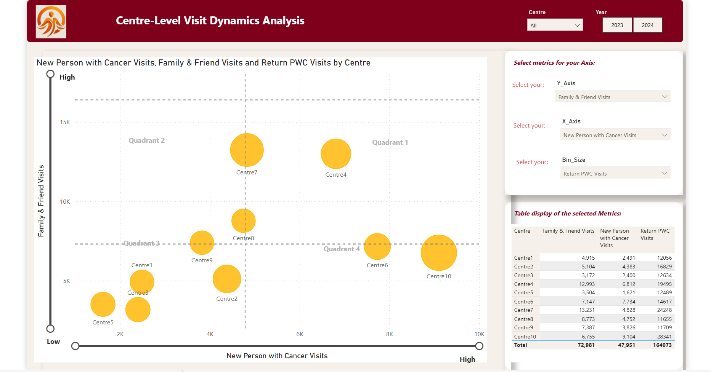
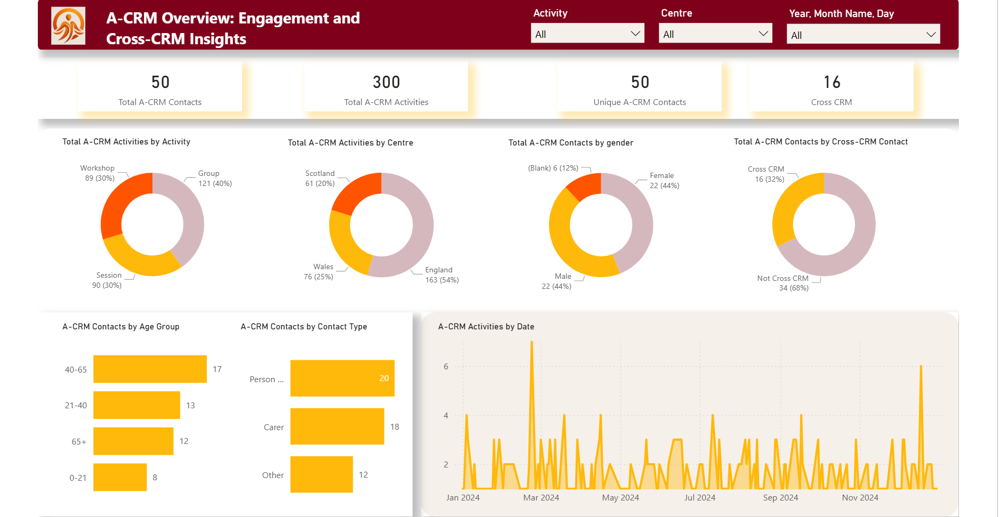
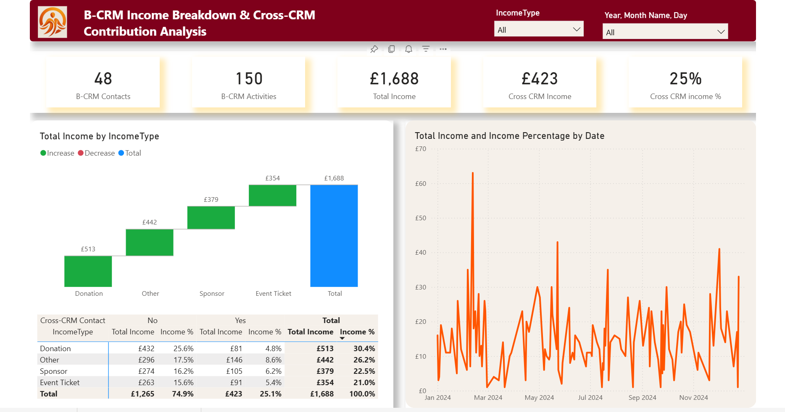

# Healthcare Support Center Analytics Portfolio

**A comprehensive Power BI analytics solution demonstrating end-to-end data analysis, modeling, and visualization capabilities**

[](https://powerbi.microsoft.com/)
[](https://dax.guide/)

---

## 📊 Project Overview

This portfolio project showcases a dual-dashboard solution developed for a healthcare support organization operating 10 regional centers. The project addresses two critical business needs:

1. **Performance Analytics Dashboard** - Real-time KPI tracking and target monitoring
2. **CRM Integration Analysis** - Cross-system data quality and revenue attribution

### Business Impact
- ✅ Enabled real-time monitoring of 5 strategic KPIs across 10 centers
- ✅ Identified 32% contact overlap between CRM systems
- ✅ Revealed cross-system contacts contribute 25% of total income
- ✅ Highlighted underperforming centers requiring intervention

---

## 🎯 Key Features

### Dashboard 1: Performance Analytics (3 Pages)

**Page 1: KPI Performance Overview**
- Five primary KPI cards with organizational totals
- Visit breakdown by category and time trends
- Gender and visit type distribution analysis
- Center-level performance matrix with conditional formatting

**Page 2: Target Performance Analysis**
- Dynamic metric selector (5 KPIs)
- Actual vs. target comparison charts
- Waterfall visualization of performance variance
- Detailed variance calculations

**Page 3: Dynamic Scatter Analysis**
- User-controlled 3-dimensional bubble chart
- Interactive parameter slicers (X-axis, Y-axis, Size)
- Correlation exploration across any metric combination

### Dashboard 2: CRM Integration Analysis (2 Pages)

**Page 1: System A Overview**
- Contact and activity volume metrics
- Multi-dimensional breakdown (type, center, gender, age group)
- Cross-CRM contact identification
- Time-series activity trends

**Page 2: System B Income Analysis**
- Revenue metrics with cross-CRM contribution
- Income breakdown by type (Donation, Sponsor, Event, Other)
- Revenue attribution across systems
- Temporal income patterns

---

## 🛠️ Technical Implementation

### Data Model Architecture
- **13 Tables** (7 for Task 1, 5 for Task 2, plus measure tables)
- **11 Active Relationships** (star schema with many-to-many)
- **38 DAX Measures** organized in logical folders
- **4 Parameter Tables** for dynamic user interaction

### Key Technical Challenges Solved

**1. Data Transformation**
- Transposed year-based columns into dimensional structure
- Parsed ratio strings (e.g., "3:7") into decimal calculations
- Standardized contact data for cross-system matching
- Created time intelligence dimensions

**2. Cross-System Data Matching**
- Fuzzy matching on email and contact details
- ID standardization and prefix removal
- Cross-referencing revenue attribution
- Duplicate contact identification (32% overlap)

**3. Advanced DAX**
```dax
// Dynamic metric selection
Dynamic Selected Actual = 
SWITCH(
    SELECTEDVALUE(Selection[Selector]),
    "Total Visit", [Total Visits],
    "New PWC", [New Person with Cancer Visits],
    "New F&F", [New Family & Friend Visits],
    ...
)

// Safe division with error handling
Visit Performance = DIVIDE([Total Visits], [Total Visit Target], 0)

// Cross-system filtering
Cross CRM = 
CALCULATE(
    [Total A-CRM Contacts],
    'A-CRM Contacts'[Cross-CRM Contact] = "Cross CRM"
)

// Revenue attribution percentage
Cross CRM Income % = DIVIDE([Cross CRM Income], [Total Income], 0)
```

---

## 📈 Key Findings

### Performance Insights
- Centre10 emerged as top performer across multiple KPIs
- Centre5 and Centre8 significantly underperformed, requiring intervention
- 65% female visitor ratio indicates need for targeted male outreach
- New:Return visitor ratio of 29% suggests conversion opportunities

### CRM Integration Insights
- 32% of System A contacts exist in both systems
- Cross-system contacts contribute 25% of total income despite representing 32% of contacts
- Donations drive majority of income across both systems
- England centers show strongest activity levels
- Seasonal patterns indicate campaign optimization opportunities

---

## 📁 Repository Contents

```
📦 powerbi-healthcare-analytics-portfolio
 ┣ 📊 Portfolio_Project.pbix              # Power BI source file
 ┣ 📄 Healthcare_Analytics_Case_Study.pdf # Detailed documentation (10 pages)
 ┣ 🖼️ screenshots/
 ┃ ┣ dashboard1_page1.png                 # KPI Overview
 ┃ ┣ dashboard1_page2.png                 # Target Analysis
 ┃ ┣ dashboard1_page3.png                 # Scatter Analysis
 ┃ ┣ dashboard2_page1.png                 # CRM System A
 ┃ ┗ dashboard2_page2.png                 # CRM Income Analysis
 ┗ 📖 README.md                            # This file
```

---

## 🎓 Skills Demonstrated

| Category | Technologies & Techniques |
|----------|--------------------------|
| **BI Platform** | Power BI Desktop, Power BI Service |
| **Data Modeling** | Star schema, many-to-many relationships, bidirectional filtering |
| **DAX** | CALCULATE, DIVIDE, SWITCH, SELECTEDVALUE, filter context manipulation |
| **Data Preparation** | Power Query M, fuzzy matching, data standardization, transposition |
| **Visualization** | KPI cards, matrix tables, scatter plots, waterfall charts, conditional formatting |
| **Business Analysis** | KPI development, target tracking, performance benchmarking, data quality assessment |

---

## 📥 How to Use This Repository

### Option 1: Download and Explore Locally (Recommended)
1. Download `Portfolio_Project.pbix`
2. Open with Power BI Desktop (free download from Microsoft)
3. Explore interactive dashboards, data model, and DAX measures
4. Review screenshots below for quick preview

*Note: Live Power BI Service link not available (requires Pro license). Download PBIX file for full interactive experience.*

### Option 2: Review Documentation
📄 **[Download Full Case Study PDF](Healthcare_Analytics_Case_Study_v2.pdf)** - Detailed 10-page methodology and analysis

---

## 🖼️ Dashboard Previews

### Task 1: Performance Analytics Dashboard

#### Page 1: KPI Performance Overview

*Real-time tracking of 330K+ visits across 10 centers with KPI cards, trend analysis, gender distribution, and performance matrix showing target achievement ranging from 88% to 110%*

#### Page 2: Actual vs Target Analysis

*Dynamic metric selector with stacked bar charts comparing actual vs target performance by center, waterfall visualization showing variance, and detailed performance table*

#### Page 3: Dynamic Scatter Analysis

*Interactive bubble chart with user-controlled dimensions exploring relationships between New PWC Visits, Family & Friend Visits, and Return PWC Visits across all centers*

### Task 2: CRM Integration Analysis

#### Page 1: System A Overview

*Cross-CRM analysis showing 50 total contacts, 300 activities, with breakdown by activity type (Workshop 30%, Session 30%, Group 40%), geographic distribution, and cross-system contact identification (32%)*

#### Page 2: Income Analysis

*Revenue tracking of £1,688 total income with waterfall chart by income type, showing 25% contribution from cross-CRM contacts and temporal income patterns throughout 2024*

---

## 💡 Strategic Recommendations

Based on the analysis, key recommendations include:

**Short-term Actions:**
1. Deploy resources to underperforming centers (Centre5, Centre8)
2. Launch targeted male outreach to balance gender ratio
3. Implement master data management for CRM duplicate resolution
4. Prioritize cross-CRM contacts for fundraising campaigns

**Long-term Initiatives:**
1. Evaluate CRM system consolidation to eliminate duplication
2. Review and adjust targets based on center capacity
3. Develop predictive models using historical patterns
4. Implement automated performance alerting

---

## 📝 License

This portfolio project is available for viewing and evaluation purposes. Please contact me before using any content or code for commercial purposes.

---

## 🙏 Acknowledgments

This project was developed as part of a data analyst interview assessment, demonstrating real-world analytical capabilities and technical proficiency in Power BI development.

---

**⭐ If you found this project interesting, please star this repository!**

*Last Updated: January 2026*
